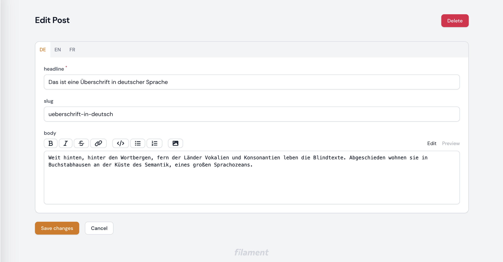
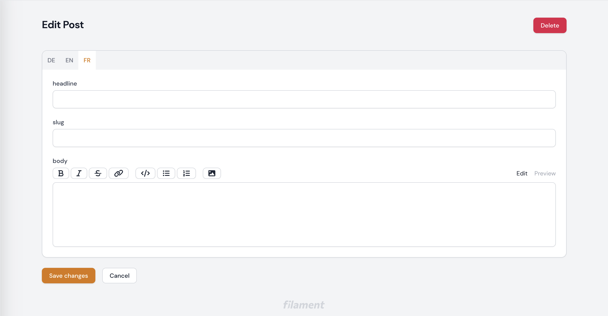

# Group multilingual fields into tabs

[](https://packagist.org/packages/pixelpeter/filament-language-tabs)
[](https://packagist.org/packages/pixelpeter/filament-language-tabs)
[](LICENSE.md)
[](https://coveralls.io/github/pixelpeter/filament-language-tabs?branch=main)
[](https://github.com/pixelpeter/filament-language-tabs/actions/workflows/run-tests.yml)
[](https://github.com/pixelpeter/filament-language-tabs/actions/workflows/fix-php-code-style-issues.yml)
[](https://github.com/pixelpeter/filament-language-tabs/actions/workflows/phpstan.yml)
[](https://github.com/pixelpeter/filament-language-tabs/actions/workflows/dependabot-auto-merge.yml)

This package is a Filament plugin that allows you to group multilingual fields into tabs. It can be configured which
languages are required to be filled out.



## Compatibility

| Filament | branch/tag |
|----------|------------|
| v4.x     | main       |
| v3.x     | v2.x       |
| v2.x     | v1.x       |

## Installation

Install the package via composer:

```bash
composer require pixelpeter/filament-language-tabs
```

Publish the config file with:

```bash
php artisan vendor:publish --tag="filament-language-tabs-config"
```

Optionally, publish the view:

```bash
php artisan vendor:publish --tag="filament-language-tabs-views"
```

This is the contents of the published config file:

```php
return [
    /*
    |--------------------------------------------------------------------------
    | Default Locales
    |--------------------------------------------------------------------------
    |
    | These are the locales this package will use generate the tabs
    |
    */
    'default_locales' => ['de', 'en', 'fr'],
    /*
    |--------------------------------------------------------------------------
    | Required Locales
    |--------------------------------------------------------------------------
    |
    | These are the locales this package will use to set the field as required
    | This can be used if one translation or language is optional
    |
    */
    'required_locales' => ['de', 'en'],
];
```

## Prerequisites

### Install spatie-translatable

```bash
composer require spatie/laravel-translatable
```

#### Create a model and make it translatable

```php
// Models/Post.php
class Post extends Model
{
    use HasFactory, HasTranslations;

    public $translatable = ['headline', 'body', 'slug'];

    protected $casts = [
        'headline' => 'array',
        'body' => 'array',
        'slug' => 'array',
    ];

    protected $guarded = ['id'];
}
```

#### Create a migration for the model

```php
// database/migrations
...    
public function up(): void
    {
        Schema::create('posts', function (Blueprint $table) {
            $table->id();
            $table->json('headline');
            $table->json('slug');
            $table->json('body');
            $table->timestamps();
        });
    }
...
```

## Setup & configuration

#### FilamentPHP V4.x

##### Method 1 (preferred): Add the LanguageTabs component to the PostForm schema

```php
// app/Filament/Resources/Posts/Schemas/PostForm.php
...
use Pixelpeter\FilamentLanguageTabs\Forms\Components\LanguageTabs;

class PostForm
{
    public static function configure(Schema $schema): Schema
    {
        return $schema
            ->components([
                LanguageTabs::make([
                    TextInput::make('headline')->label('headline')->required(),
                    TextInput::make('slug')->label('slug'),
                    MarkdownEditor::make('body')->label('body'),
                ]),
            ]);
    }
}
```


##### Method 2: Add the LanguageTabs component directly to the Filament resource

```php
// app/Filament/Resources/PostResource.php
...
use Pixelpeter\FilamentLanguageTabs\Forms\Components\LanguageTabs;

class PostResource extends Resource
{
    public static function form(Form $form): Form
    {
        return $form
            ->components([
                LanguageTabs::make([
                    Forms\Components\TextInput::make('headline')->label('headline')->required(),
                    Forms\Components\TextInput::make('slug')->label('slug'),
                    Forms\Components\MarkdownEditor::make('body')->label('body'),   
                ]),
            ]);
    }
```
#### FilamentPHP V3.x

##### Add the LanguageTabs component to your Filament resource

```php
// app/Filament/Resources/PostResource.php
...
use Pixelpeter\FilamentLanguageTabs\Forms\Components\LanguageTabs;

class PostResource extends Resource
{
    public static function form(Form $form): Form
    {
        return $form
            ->schema([
                LanguageTabs::make([
                    Forms\Components\TextInput::make('headline')->label('headline')->required(),
                    Forms\Components\TextInput::make('slug')->label('slug'),
                    Forms\Components\MarkdownEditor::make('body')->label('body'),   
                ]),
            ]);
    }
```

#### Configure which languages to add to the tabs

```php 
// config/filament-language-tabs.php
return [
    'default_locales' => ['de', 'en', 'fr'],
]
```

#### Configure for which languages a field is required

If a field is defined as `required`

```php 
...
->schema([
    Forms\Components\TextInput::make('headline')->label('headline')->required(),
    ...
]),    
...
```

it will only be set as required for the languages configured in `required_locals`

```php
// config/filament-language-tabs.php
return [
    'required_locales' => ['de', 'en'],
]
```


*The `headline` is not (marked as) required for French language*

## Testing

```bash
./vendor/bin/pest
```

## Changelog

Please see [CHANGELOG](CHANGELOG.md) for more information on what has changed recently.

## Contributing

Please see [CONTRIBUTING](.github/CONTRIBUTING.md) for details.

## Security Vulnerabilities

Please review [the security policy](../../security/policy) on how to report security vulnerabilities.

## Credits

- [pixelpeter](https://github.com/pixelpeter)
- Thanks to [ralphjsmit](https://github.com/ralphjsmit) for the inspiration of creating
  a [TestableForm](https://github.com/ralphjsmit/laravel-filament-components/blob/main/tests/Support/TestableForm.php)
  to help with testing this component
- [All Contributors](../../contributors)

## License

The MIT License (MIT). Please see [License File](LICENSE.md) for more information.
